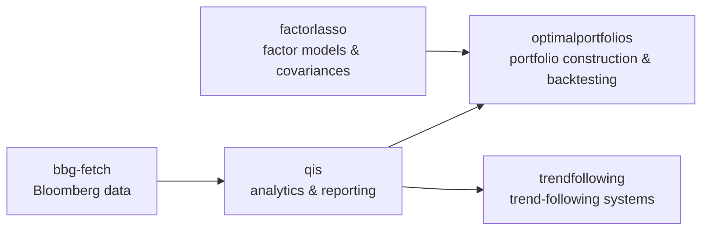

# Artur Sepp

**Quantitative Researcher | [Risk Magazine Quant of the Year 2024](https://www.risk.net/awards/7958305/quant-of-the-year-artur-sepp)**

Quantitative researcher focused on systematic strategies, portfolio optimization, and stochastic volatility modeling. Currently Global Head of Quantitative Analytics at [LGT Private Banking](https://www.lgt.com/). Co-originator of the Robust Optimisation of Strategic and Active Asset Allocation (ROSAA) framework and the Karasinski-Sepp log-normal beta stochastic volatility model.

For publications, speaking, and full background → [artursepp.com](https://artursepp.com)

[](https://artursepp.com)
[](https://www.linkedin.com/in/artursepp/)
[](https://twitter.com/artursepp)
[](https://scholar.google.com/citations?user=UJy2xxMAAAAJ&hl=en)
[](https://papers.ssrn.com/sol3/cf_dev/AbsByAuth.cfm?per_id=1229200)

---

## Python Packages

Over 20+ years of building quantitative models — across equity, credit and rates derivatives on the sell-side, a systematic CTA, market-neutral crypto/DeFi, and now multi-asset private banking — one pattern holds: volatility regimes migrate across asset classes, and models that feel robust fail at the worst moment. This ecosystem is my working answer: open-source, production-grade implementations of frameworks designed to survive regime change, spanning the full quant workflow from market data to signal generation, factor modeling, and portfolio construction.

Each package is developed alongside my published research — the papers ship with code you can run, and the code carries the exact methodology of the papers. They are used by practitioners and researchers in quantitative finance.

The packages compose into a single research workflow — market data → analytics and reporting → factor models → portfolio construction — with standalone research libraries alongside:




Standalone research libraries: [`stochvolmodels`](https://github.com/ArturSepp/StochVolModels), [`vanilla-option-pricers`](https://github.com/ArturSepp/VanillaOptionPricers), [`goal-based-allocation`](https://github.com/ArturSepp/GoalBasedAllocation).

### Portfolio Construction & Factor Analytics

`factorlasso` estimates the sparse factor model and the factor covariance; `optimalportfolios` consumes them — together with the `qis` analytics engine — for portfolio construction and backtesting.

#### [OptimalPortfolios](https://github.com/ArturSepp/OptimalPortfolios) (`optimalportfolios`)
Implementation of optimization analytics for constructing and backtesting optimal portfolios in Python. Companion code to [Sepp (2023)](https://ssrn.com/abstract=4217841) and [Sepp, Ossa & Kastenholz (2026)](https://www.pm-research.com/content/iijpormgmt/52/4/86).

```bash
pip install optimalportfolios
```

**Features:**
- Portfolio optimization algorithms
- Risk budgeting implementation
- Backtesting frameworks
- Performance attribution

#### [factorlasso](https://github.com/ArturSepp/factorlasso) (`factorlasso`)
Sparse factor model estimation with sign-constrained LASSO, prior-centered regularisation, and hierarchical group LASSO (HCGL) with integrated factor covariance assembly. Companion code to [Sepp, Ossa & Kastenholz (2026)](https://www.pm-research.com/content/iijpormgmt/52/4/86) and [Sepp, Hansen & Kastenholz (2026)](https://papers.ssrn.com/sol3/papers.cfm?abstract_id=6785958).

```bash
pip install factorlasso
```

**Features:**
- Sign-constrained LASSO and Group LASSO via CVXPY
- Prior-centered regularisation (shrink toward β₀, not zero)
- Hierarchical Clustering Group LASSO (HCGL) with auto-discovered groups
- NaN-aware estimation for variables with different history lengths
- Consistent factor covariance assembly (Σ_y = β Σ_x β' + D)
- scikit-learn compatible API (fit / predict / score)

---

### Analytics & Data

#### [QuantInvestStrats](https://github.com/ArturSepp/QuantInvestStrats) (`qis`)
Quantitative Investment Strategies (QIS) package implements Python analytics for visualisation of financial data, performance reporting, analysis of quantitative strategies. `qis` is the analytics and reporting engine behind `optimalportfolios` and `trendfollowing`.

```bash
pip install qis
```

**Features:**
- Performance reporting: risk-adjusted performance tables with returns, volatilities, Sharpe ratios, and benchmark regressions
- Factsheet generation: multi-asset, strategy, strategy vs benchmark, and multi-strategy factsheets
- Visualisation layer for financial time series built on matplotlib/seaborn
- Portfolio analytics and performance attribution

#### [BloombergFetch](https://github.com/ArturSepp/BloombergFetch) (`bbg-fetch`)
Python functionality for getting different data from Bloomberg: prices, implied vols, fundamentals.

```bash
pip install bbg-fetch
```

**Features:**
- Bloomberg data fetching wrapper
- Price data retrieval
- Implied volatility data
- Fundamental data access
- Direct `blpapi` integration (no `xbbg` dependency)

---

### Systematic Strategies & Goal-Based Allocation

#### [TrendFollowingSystems](https://github.com/ArturSepp/TrendFollowingSystems) (`trendfollowing`)
Replication package for *The Science and Practice of Trend-Following Systems*. Companion code to [Sepp & Lucic (2026)](https://papers.ssrn.com/sol3/papers.cfm?abstract_id=3167787).

```bash
pip install trendfollowing
```

**Features:**
- Closed-form expected return, Sharpe ratio, skewness, and turnover of trend-following systems under white noise, AR(1), and ARFIMA processes
- Three complete system implementations: European, American, and Time Series Momentum (TSMOM)
- Monte Carlo verification of analytical results
- 84-contract futures dataset spanning 1959–2026

#### [GoalBasedAllocation](https://github.com/ArturSepp/GoalBasedAllocation) (`goal-based-allocation`)
Analytical Laplace-transform framework for dynamic mean-variance portfolio allocation under regime-switching jump-diffusions with absorbing wealth floors. Companion code to [Sepp (2026)](https://papers.ssrn.com/sol3/papers.cfm?abstract_id=6534579).

```bash
pip install goal-based-allocation
```

**Features:**
- Riccati ODE system for MV-optimal policy with regime-dependent coefficients
- Terminal wealth density decomposition (survived + floor atom + overshoot)
- Exact buy-and-hold moments via matrix exponential
- Investment opportunity set construction with endogenous de-risking glide paths
- Monte Carlo simulator for validation

---

### Derivatives & Volatility

#### [StochVolModels](https://github.com/ArturSepp/StochVolModels) (`stochvolmodels`)
Python implementation of pricing analytics and Monte Carlo simulations for stochastic volatility models including the Karasinski-Sepp log-normal beta SV model and the Heston model. Companion code to [Sepp & Rakhmonov (2023)](https://www.worldscientific.com/doi/10.1142/S0219024924500031).

```bash
pip install stochvolmodels
```

**Features:**
- Karasinski-Sepp log-normal beta SV model
- Heston model
- Monte Carlo simulations
- Analytical valuation of European call and put options

#### [VanillaOptionPricers](https://github.com/ArturSepp/VanillaOptionPricers) (`vanilla-option-pricers`)
Python implementation of vectorised pricers and implied volatility fitters for vanilla options under Black-Scholes-Merton and Bachelier models.

```bash
pip install vanilla-option-pricers
```

**Features:**
- Black-Scholes-Merton log-normal option pricing
- Bachelier normal option pricing
- Vectorised implied volatility fitters
- Numba-accelerated implementation

---

### Download Statistics

<!-- STATS_START -->
| Package | Stars | Forks | Total Downloads | Monthly |
|---------|:-----:|:-----:|:---------------:|:-------:|
| [OptimalPortfolios](https://github.com/ArturSepp/OptimalPortfolios) | [](https://github.com/ArturSepp/OptimalPortfolios/stargazers) | [](https://github.com/ArturSepp/OptimalPortfolios/network/members) | [](https://pepy.tech/project/optimalportfolios) | [](https://pepy.tech/project/optimalportfolios) |
| [factorlasso](https://github.com/ArturSepp/factorlasso) | [](https://github.com/ArturSepp/factorlasso/stargazers) | [](https://github.com/ArturSepp/factorlasso/network/members) | [](https://pepy.tech/project/factorlasso) | [](https://pepy.tech/project/factorlasso) |
| [QuantInvestStrats](https://github.com/ArturSepp/QuantInvestStrats) | [](https://github.com/ArturSepp/QuantInvestStrats/stargazers) | [](https://github.com/ArturSepp/QuantInvestStrats/network/members) | [](https://pepy.tech/project/qis) | [](https://pepy.tech/project/qis) |
| [BloombergFetch](https://github.com/ArturSepp/BloombergFetch) | [](https://github.com/ArturSepp/BloombergFetch/stargazers) | [](https://github.com/ArturSepp/BloombergFetch/network/members) | [](https://pepy.tech/project/bbg-fetch) | [](https://pepy.tech/project/bbg-fetch) |
| [TrendFollowingSystems](https://github.com/ArturSepp/TrendFollowingSystems) | [](https://github.com/ArturSepp/TrendFollowingSystems/stargazers) | [](https://github.com/ArturSepp/TrendFollowingSystems/network/members) | [](https://pepy.tech/project/trendfollowing) | [](https://pepy.tech/project/trendfollowing) |
| [GoalBasedAllocation](https://github.com/ArturSepp/GoalBasedAllocation) | [](https://github.com/ArturSepp/GoalBasedAllocation/stargazers) | [](https://github.com/ArturSepp/GoalBasedAllocation/network/members) | [](https://pepy.tech/project/goal-based-allocation) | [](https://pepy.tech/project/goal-based-allocation) |
| [StochVolModels](https://github.com/ArturSepp/StochVolModels) | [](https://github.com/ArturSepp/StochVolModels/stargazers) | [](https://github.com/ArturSepp/StochVolModels/network/members) | [](https://pepy.tech/project/stochvolmodels) | [](https://pepy.tech/project/stochvolmodels) |
| [VanillaOptionPricers](https://github.com/ArturSepp/VanillaOptionPricers) | [](https://github.com/ArturSepp/VanillaOptionPricers/stargazers) | [](https://github.com/ArturSepp/VanillaOptionPricers/network/members) | [](https://pepy.tech/project/vanilla-option-pricers) | [](https://pepy.tech/project/vanilla-option-pricers) |
<!-- STATS_END -->
