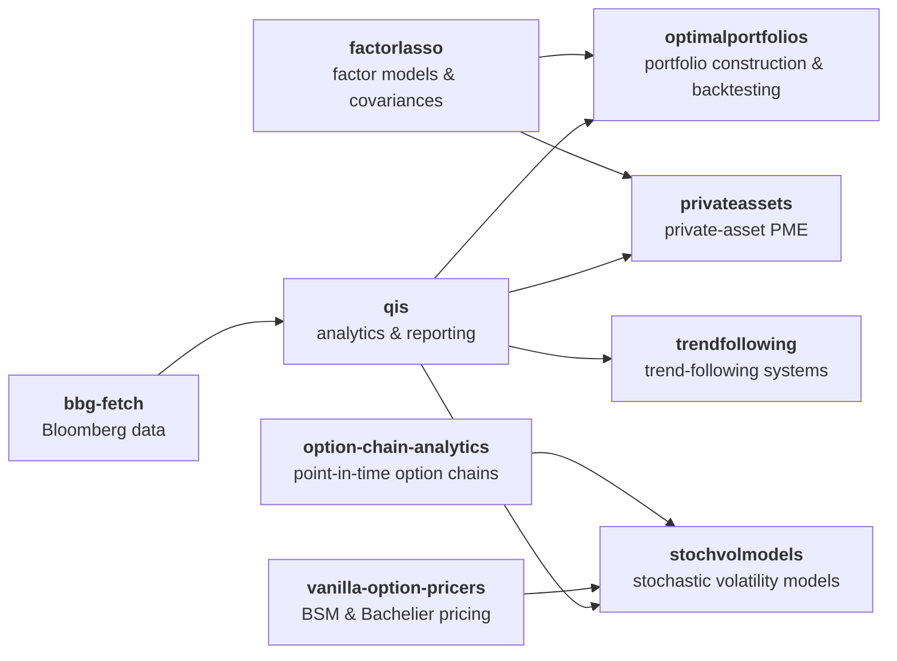

# Artur Sepp

**Quantitative Researcher & Open-Source Author | [Risk Magazine Quant of the Year 2024](https://www.risk.net/awards/7958305/quant-of-the-year-artur-sepp)**

Focused on systematic strategies, portfolio optimisation, stochastic volatility modelling, and robust statistical methods. Currently Global Head of Quantitative Analytics at [LGT Private Banking](https://www.lgt.com/). Co-originator of the Robust Optimisation of Strategic and Active Asset Allocation (ROSAA) framework and the Karasinski-Sepp log-normal beta stochastic volatility model.

For publications, speaking, and full background → [artursepp.com](https://artursepp.com)

[](https://artursepp.com)
[](https://www.linkedin.com/in/artursepp/)
[](https://twitter.com/artursepp)
[](https://scholar.google.com/citations?user=UJy2xxMAAAAJ)
[](https://ssrn.com/author=1229200)
[](https://orcid.org/0000-0002-7038-1748)

---

## Python Packages

Over 20 years of building quantitative models — across equity, credit and rates derivatives on the sell-side, a systematic CTA, market-neutral crypto/DeFi, and now multi-asset private banking — one pattern holds: volatility regimes migrate across asset classes, and models that feel robust fail at the worst moment. These ten open-source packages are my working answer, spanning the full quant workflow from market data — prices, fundamentals and point-in-time option chains — to signal generation, factor modelling, and portfolio construction, through to performance measurement of private assets.

Developed alongside my published research, these packages provide runnable implementations of the methods described in the papers. <!-- TOTALS_START -->Together, the repositories have received more than 1,000 stars and 190 forks.<!-- TOTALS_END -->

New to the ecosystem? Start with `qis` for analytics and reporting, `optimalportfolios` for portfolio construction, or `stochvolmodels` for volatility modelling.

### Package Overview

<!-- STATS_START -->
| Package | Concept | Version | Stars | Forks | Monthly<br>Downloads | Total<br>Downloads |
|---------|---------|:-------:|:-----:|:-----:|:-----------------:|:---------------:|
| **Portfolio Construction, Factor Models, Backtest Reporting** | | | | | | |
| [QuantInvestStrats](https://github.com/ArturSepp/QuantInvestStrats) (qis) | Performance analytics, backtesting and factsheets | [](https://pypi.org/project/qis/) | **[627](https://github.com/ArturSepp/QuantInvestStrats/stargazers)** | **[71](https://github.com/ArturSepp/QuantInvestStrats/network/members)** | **[20k](https://pepy.tech/project/qis)** | **[202k](https://pepy.tech/project/qis)** |
| [OptimalPortfolios](https://github.com/ArturSepp/OptimalPortfolios) (optimalportfolios) | Portfolio optimisation and rolling backtests | [](https://pypi.org/project/optimalportfolios/) | **[93](https://github.com/ArturSepp/OptimalPortfolios/stargazers)** | **[38](https://github.com/ArturSepp/OptimalPortfolios/network/members)** | **[10k](https://pepy.tech/project/optimalportfolios)** | **[67k](https://pepy.tech/project/optimalportfolios)** |
| [factorlasso](https://github.com/ArturSepp/factorlasso) (factorlasso) | Sparse factor models with sign-constrained LASSO | [](https://pypi.org/project/factorlasso/) | **[27](https://github.com/ArturSepp/factorlasso/stargazers)** | **[6](https://github.com/ArturSepp/factorlasso/network/members)** | **[10k](https://pepy.tech/project/factorlasso)** | **[30k](https://pepy.tech/project/factorlasso)** |
| **Volatility and Option Modelling** | | | | | | |
| [StochVolModels](https://github.com/ArturSepp/StochVolModels) (stochvolmodels) | Stochastic volatility pricing and calibration | [](https://pypi.org/project/stochvolmodels/) | **[235](https://github.com/ArturSepp/StochVolModels/stargazers)** | **[48](https://github.com/ArturSepp/StochVolModels/network/members)** | **[3k](https://pepy.tech/project/stochvolmodels)** | **[30k](https://pepy.tech/project/stochvolmodels)** |
| [OptionChainAnalytics](https://github.com/ArturSepp/OptionChainAnalytics) (option-chain-analytics) | Point-in-time option-chain data and queries | [](https://pypi.org/project/option-chain-analytics/) | **[3](https://github.com/ArturSepp/OptionChainAnalytics/stargazers)** | **[1](https://github.com/ArturSepp/OptionChainAnalytics/network/members)** | **[3k](https://pepy.tech/project/option-chain-analytics)** | **[18k](https://pepy.tech/project/option-chain-analytics)** |
| [VanillaOptionPricers](https://github.com/ArturSepp/VanillaOptionPricers) (vanilla-option-pricers) | Vectorised BSM and Bachelier pricing | [](https://pypi.org/project/vanilla-option-pricers/) | **[14](https://github.com/ArturSepp/VanillaOptionPricers/stargazers)** | **[9](https://github.com/ArturSepp/VanillaOptionPricers/network/members)** | **[2k](https://pepy.tech/project/vanilla-option-pricers)** | **[8k](https://pepy.tech/project/vanilla-option-pricers)** |
| **Dynamic Trading Strategies** | | | | | | |
| [TrendFollowingSystems](https://github.com/ArturSepp/TrendFollowingSystems) (trendfollowing) | Closed-form trend-following analytics | [](https://pypi.org/project/trendfollowing/) | **[25](https://github.com/ArturSepp/TrendFollowingSystems/stargazers)** | **[6](https://github.com/ArturSepp/TrendFollowingSystems/network/members)** | **[829](https://pepy.tech/project/trendfollowing)** | **[2k](https://pepy.tech/project/trendfollowing)** |
| [GoalBasedAllocation](https://github.com/ArturSepp/GoalBasedAllocation) (goal-based-allocation) | Goal-based allocation with wealth floors | [](https://pypi.org/project/goal-based-allocation/) | **[12](https://github.com/ArturSepp/GoalBasedAllocation/stargazers)** | **[2](https://github.com/ArturSepp/GoalBasedAllocation/network/members)** | **[922](https://pepy.tech/project/goal-based-allocation)** | **[2k](https://pepy.tech/project/goal-based-allocation)** |
| **Illiquid Private Markets** | | | | | | |
| [privateassets](https://github.com/ArturSepp/privateassets) (privateassets) | Multi-factor PME for private assets | [](https://pypi.org/project/privateassets/) | **[4](https://github.com/ArturSepp/privateassets/stargazers)** | **[1](https://github.com/ArturSepp/privateassets/network/members)** | **[643](https://pepy.tech/project/privateassets)** | **[1k](https://pepy.tech/project/privateassets)** |
| **Data** | | | | | | |
| [BloombergFetch](https://github.com/ArturSepp/BloombergFetch) (bbg-fetch) | Bloomberg data in pandas DataFrames | [](https://pypi.org/project/bbg-fetch/) | **[19](https://github.com/ArturSepp/BloombergFetch/stargazers)** | **[8](https://github.com/ArturSepp/BloombergFetch/network/members)** | **[2k](https://pepy.tech/project/bbg-fetch)** | **[40k](https://pepy.tech/project/bbg-fetch)** |
<!-- STATS_END -->

Stars, forks and download counts are refreshed automatically by a GitHub Action; the version badge is live.

---

## One Research Workflow

The packages compose into a single research workflow — market data → analytics and reporting → factor models → portfolio construction — with an options branch where vanilla pricing and point-in-time chains feed stochastic volatility modelling:


```mermaid
flowchart LR
    fl["`**factorlasso**
    factor models & covariances`"]
    qis["`**qis**
    analytics & reporting`"]
    oca["`**option-chain-analytics**
    point-in-time option chains`"]
    vop["`**vanilla-option-pricers**
    BSM & Bachelier pricing`"]
    bbg["`**bbg-fetch**
    Bloomberg data`"] --> qis
    bbg ~~~ fl
    bbg ~~~ oca
    bbg ~~~ vop
    fl --> op["`**optimalportfolios**
    portfolio construction & backtesting`"]
    qis --> op
    fl --> pa["`**privateassets**
    private-asset PME`"]
    qis --> pa
    qis --> tf["`**trendfollowing**
    trend-following systems`"]
    oca --> svm["`**stochvolmodels**
    stochastic volatility models`"]
    vop --> svm
    qis --> svm
```

[`goal-based-allocation`](https://github.com/ArturSepp/GoalBasedAllocation) is a standalone research library within the broader ecosystem.

---

## Package Features

### Portfolio Construction, Factor Models, Backtest Reporting

`factorlasso` estimates the sparse factor model and the factor covariance; `optimalportfolios` consumes them — together with the `qis` analytics engine — for portfolio construction and backtesting.

#### [QuantInvestStrats](https://github.com/ArturSepp/QuantInvestStrats) (`qis`)
`qis` provides Python tools for financial-data visualisation, performance reporting, and quantitative-strategy analysis. It is the analytics and reporting engine behind `optimalportfolios`, `trendfollowing` and `option-chain-analytics`.

```bash
pip install qis
```

**Features:**
- Backtesting engine for externally computed weights with provided instrument price, carry and cost data
- Performance reporting and factsheets: risk-adjusted tables, benchmark regressions and attribution, for multi-asset, strategy, strategy vs benchmark and multi-strategy
- Visualisation layer for financial time series built on matplotlib/seaborn

#### [OptimalPortfolios](https://github.com/ArturSepp/OptimalPortfolios) (`optimalportfolios`)
Implementation of optimisation analytics for constructing and backtesting optimal portfolios in Python. Companion code to [Sepp (2023)](https://ssrn.com/abstract=4217841) and [Sepp, Ossa & Kastenholz (2026)](https://www.pm-research.com/content/iijpormgmt/52/4/86).

```bash
pip install optimalportfolios
```

**Features:**
- Risk budgeting, alpha-focused and benchmark-constrained optimisers
- Backtesting frameworks for roll-forward analysis with handling of incomplete and missing data
- Performance attribution

#### [factorlasso](https://github.com/ArturSepp/factorlasso) (`factorlasso`)
Sparse factor model estimation with sign-constrained LASSO, prior-centred regularisation, hierarchical clustering group LASSO (HCGL) and factor-clustering group LASSO (FCGL), with integrated factor covariance assembly. Companion code to [Sepp, Ossa & Kastenholz (2026)](https://www.pm-research.com/content/iijpormgmt/52/4/86) and [Sepp, Hansen & Kastenholz (2026)](https://papers.ssrn.com/sol3/papers.cfm?abstract_id=6785958).

```bash
pip install factorlasso
```

**Features:**
- Sign-constrained LASSO and Group LASSO via CVXPY, with prior-centred regularisation (shrink toward β₀, not zero)
- Hierarchical Clustering Group LASSO (HCGL) and Factor-Clustering Group LASSO (FCGL) with auto-discovered groups
- NaN-aware estimation for variables with different history lengths
- Consistent factor covariance assembly (Σ_y = β Σ_x β' + D), scikit-learn compatible API (fit / predict / score)

---

### Volatility and Option Modelling

#### [StochVolModels](https://github.com/ArturSepp/StochVolModels) (`stochvolmodels`)
Python implementation of pricing analytics and Monte Carlo simulations for stochastic volatility models including the Karasinski-Sepp log-normal beta SV model and the Heston model. Companion code to [Sepp & Rakhmonov (2023)](https://www.worldscientific.com/doi/10.1142/S0219024924500031) and [Sepp & Rakhmonov (2025)](https://doi.org/10.1007/s11147-025-09217-4).

```bash
pip install stochvolmodels
```

**Features:**
- Karasinski-Sepp log-normal beta SV model, with the Heston model as benchmark
- Factor Heath-Jarrow-Morton framework for rates with log-normal stochastic volatility
- Analytical valuation of European call and put options, and Monte Carlo simulations

#### [VanillaOptionPricers](https://github.com/ArturSepp/VanillaOptionPricers) (`vanilla-option-pricers`)
Python implementation of vectorised pricers and implied volatility fitters for vanilla options under Black-Scholes-Merton and Bachelier models. The pricing kernel of `option-chain-analytics`.

```bash
pip install vanilla-option-pricers
```

**Features:**
- Black-Scholes-Merton log-normal and Bachelier normal option pricing
- Vectorised implied volatility fitters
- Numba-accelerated implementation

#### [OptionChainAnalytics](https://github.com/ArturSepp/OptionChainAnalytics) (`option-chain-analytics`)
Point-in-time option-chain containers, feed normalisation, chain reconstruction, queries and visualisation. The public data-container layer for empirical option research: pricing and implied-volatility inversion are delegated to `vanilla-option-pricers`, time-series and plotting utilities to `qis`.

```bash
pip install option-chain-analytics
```

**Features:**
- Timezone-aware point-in-time containers (`OptionsDataDFs`, `SlicesChain`, `ExpirySlice`) with exact-time chain reconstruction and no look-ahead
- Provider adapters behind optional extras — CBOE fitted chains, Deribit/Tardis crypto histories, ThetaData EOD equity/ETF reports, Bloomberg via `bbg-fetch` — normalised to one schema with resumable Parquet caches
- ATM-volatility and delta-skew queries, rolling vol and skew time series, and multi-page PDF chain reports

---

### Dynamic Trading Strategies

#### [TrendFollowingSystems](https://github.com/ArturSepp/TrendFollowingSystems) (`trendfollowing`)
Replication package for *The Science and Practice of Trend-Following Systems*. Companion code to [Sepp & Lucic (2026)](https://papers.ssrn.com/sol3/papers.cfm?abstract_id=3167787).

```bash
pip install trendfollowing
```

**Features:**
- Closed-form expected return, Sharpe ratio, skewness, and turnover of trend-following systems under white noise, AR(1), and ARFIMA processes, verified by Monte Carlo
- Three complete system implementations: European, American, and Time Series Momentum (TSMOM)
- 84-contract futures dataset spanning 1959–2026

#### [GoalBasedAllocation](https://github.com/ArturSepp/GoalBasedAllocation) (`goal-based-allocation`)
Analytical Laplace-transform framework for dynamic mean-variance portfolio allocation under regime-switching jump-diffusions with absorbing wealth floors. Companion code to [Sepp (2026)](https://papers.ssrn.com/sol3/papers.cfm?abstract_id=6534579).

```bash
pip install goal-based-allocation
```

**Features:**
- Riccati ODE system for MV-optimal policy with regime-dependent coefficients
- Terminal wealth density decomposition (survived + floor atom + overshoot), with exact buy-and-hold moments via matrix exponential
- Investment opportunity set construction with endogenous de-risking glide paths, validated against a Monte Carlo simulator

---

### Illiquid Private Markets

#### [privateassets](https://github.com/ArturSepp/privateassets) (`privateassets`)
Multi-factor, money-weighted PME for private-asset cash flows: generalises Direct Alpha, KS-PME and GPME from a single benchmark to a tradable multi-factor deflator, with the classical measures shipped alongside for comparison on the same cash flows.

```bash
pip install privateassets
```

**Features:**
- Fund reporting to alpha in one call: NAV-implied returns → AR(1) unsmoothing with bootstrap bias correction → sign-constrained factor betas → multi-factor deflator → per-vintage and capital-weighted alpha with bootstrap intervals
- Point-in-time covariance with no look-ahead, enforced by tests; provenance (versions, seed, specification) travels with every result
- Classical single-benchmark measures (Direct Alpha, KS-PME, GPME) alongside the multi-factor versions

---

### Data

#### [BloombergFetch](https://github.com/ArturSepp/BloombergFetch) (`bbg-fetch`)
`bbg-fetch` retrieves Bloomberg prices, implied volatilities, option chains, and fundamentals into pandas DataFrames through `blpapi`.

```bash
pip install bbg-fetch
```

**Features:**
- Prices, implied vols, option chains and fundamentals
- Direct `blpapi` integration
